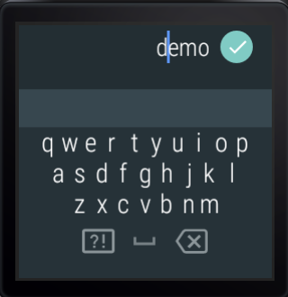
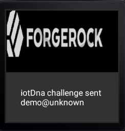

# iotDNA Wearable

This Android Wear APK from ForgeRock illustrates an integration with ImageWare's "device fingerprinting" technology known as "iotDNA". The first part of the integration uses a stand-alone collection of iotDNA ReST calls to enroll an Android Wear device; the second part then uses said device as part of the Authentication Tree described at https://github.com/javaservlets/iotDnaAuthNode.

This document assumes that you already have:
> 1. an Android Wear 2.0+ device on which to install the verification APK described below
> 2. access to the Queue Reader described at https://github.com/javaservlets/queueAuthNode

## Configuration in iotDNA

At a high-level, in iotDNA via the following calls first get an access token, then based on a device's serial number (see #2 above) coupled with a user's name, enroll it. The result will be a GUID which will be needed during the 'verify' call which takes place later in the Authentication Node. 

Thus for a user 'demo' with a wearable serial number of '601KPZK0343037'

A. curl -X POST https://{your iotDNA server address}/usermanager/oauth/token -d 'scope=IGNORED&grant_type=client_credentials' -H 'Content-Type: application/x-www-form-urlencoded' -H 'Authorization: Basic {your base64 encoded credentials}'

= **{result 1}**

B. curl -X POST --header 'Content-Type: application/json' --header 'Accept: application/json' --header 'Authorization: Bearer {result 1}' -d '{ "allowDuplicate": true, "categories": [ "apk" ], "signature": {"signature":"demo601KPZK0343037"} }' 'https://{your iotDNA server address}/tenant/1/iot/enroll'

= **{result 2}**

C. Update in ForgeRock the user's attribute of **sunIdentityMSISDNNumber** with **{result 2}**. This will be checked later by the Authentication Node described above.

## Installation of the Wearable APK

1. Import this project into Android Studio and deploy the APK to your watch, or side-load the APK from ./app/app-debug.apk

2. Open the app on your phone  

## Configuration in ForgeRock

1. Configure the Authentication Tree described at https://github.com/javaservlets/iotDnaAuthNode

## Verification in a browser
1. In a new private browser window navigate to http:(your AM instance name)/openam/XUI/#login&service=iotDNA . Enter a user's name that has been enrolled with the GUID described above in step C.

## Verification on your watch
1. At this point the Authentication Tree is waiting for the user to run the Wearable APK

2. The Wearable assumes a username of 'demo'. If another name has instead been used during steps B and C above, click on the bottom of the ForgeRock logo and enter the new name

3. Click on the ImageWare logo. This will send the serial number of the device to the Queue Reader node described above

4. The browser window you opened in step #1 above should now log you all the way.
